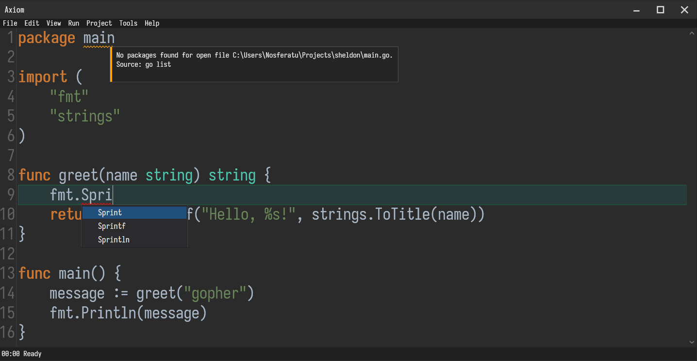

> _Native windows text editor in C# with multi language and LSP support._



> [!Important]
> Work in Progress

## Getting Started

```powershell
dotnet restore
dotnet build axiom.sln
```

> Requires .NET 8 SDK (Windows Desktop Runtime).

Run the Application:

```powershell
dotnet run --project Axiom/Axiom.csproj
```

Build Release version:

```powershell
dotnet build -c Release
```

> The executable will be located inside `Axiom\bin\Release\net8.0-windows\`.

Publish Standalone Executable (create a self-contained Windows executable):

```powershell
dotnet publish -c Release -r win-x64 --self-contained true
```

> The executable will be located inside `Axiom\bin\Release\net8.0-windows\win-x64\publish\`. <br>
> This produces a runnable .exe without requiring .NET installation.

## Notes

1. This is a **Windows-only** application due to WPF.
2. Make sure you are using the **.NET SDK**, not only the runtime.

## Courtesy

1. [AvalonEdit](http://avalonedit.net): WPF-based text editor component
   by [Daniel Grunwald](https://github.com/dgrunwald).
2. [Advanced TextMarkers usage in AvalonEdit](https://github.com/siegfriedpammer/AvalonEditSamples/)
   by [Siegfried Pammer](https://github.com/siegfriedpammer).

## References

1. GopherCon UK conference session on ["Understanding Language Server Protocol"](https://youtu.be/EkK8Jxjj95s)
   by [Adrian Hesketh](https://github.com/a-h).